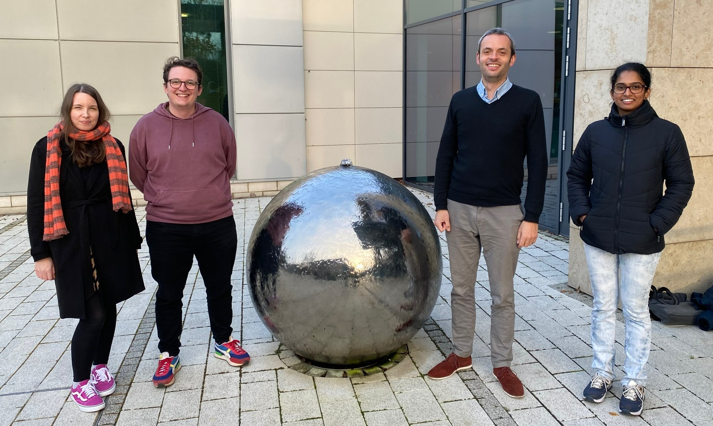
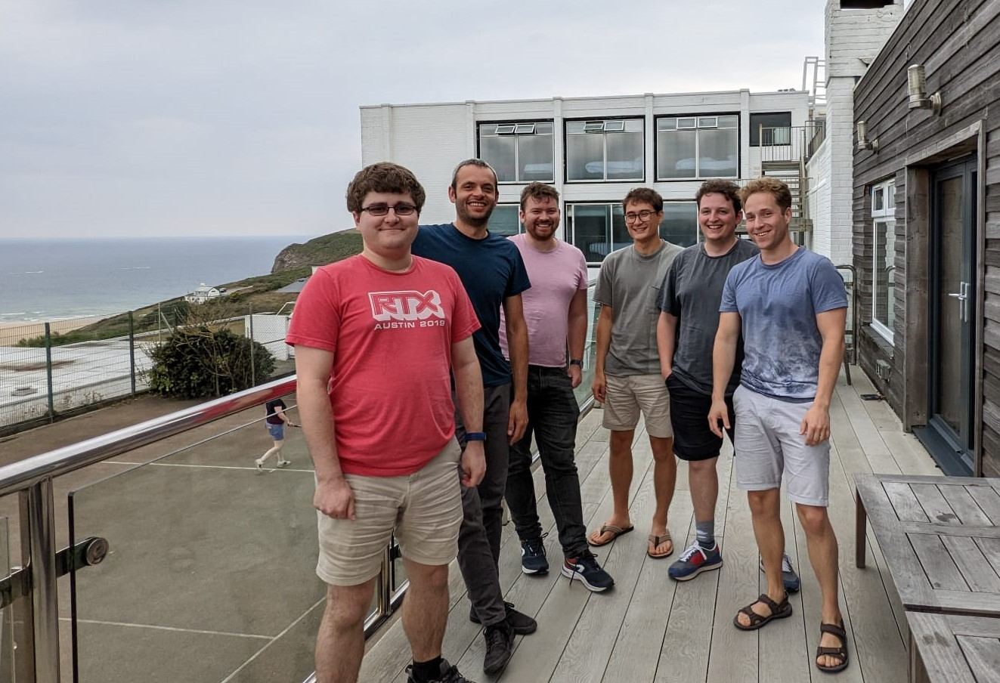

+++
title = 'Group'
layout = 'single_nodate'
+++

*Figure 1: Left-to-right: Samantha Ferrett, Danny McCulloch, me, Monisha Natchiar. Researching the Black-Scholes equation. December 2022.*

*Figure 2: Left-to-right: Robbie Ridgway, me, Alex Loader, Jake Eager, Danny McCulloch (encore), Denis Sergeev. We're literally in Cornwall. September 2022.*

### I currently work with the following people:

[**Alex Loader**](https://experts.exeter.ac.uk/35300-alex-loader/about) is a PhD student
  working on how interactions between physics and chemistry influence
  the fate of condensibles on exoplanets. He is supervised by me and [Eric Hebrard](http://emps.exeter.ac.uk/physics-astronomy/staff/eh484). 

[**Danny McCulloch**](https://physics-astronomy.exeter.ac.uk/staff/dm575) is a PhD student
  working on the local and remote effects of the interactions between
  cloud and circulation, associated with the NERC CIRCULATES
  project. He is supervised by me, Mark Webb at the Met Office and [Geoff Vallis](http://empslocal.ex.ac.uk/people/staff/gv219/).

[**Monisha Natchiar**](https://experts.exeter.ac.uk/35547-monisha-natchiar-subbiah-renganathan/about) is a
  research fellow working on understanding cloud
  feedbacks as part of the NERC CIRCULATES project with [Geoff Vallis](http://empslocal.ex.ac.uk/people/staff/gv219/)
  and me.

[**Kasturi Singh**](http://mathematics.exeter.ac.uk/staff/ks1034) is a Leverhulme funded
	     research fellow 
	     working on understanding parametric and structural
	     uncertainty in NWP modelling in collaboration
	     with [Hannah
	     Christensen](https://www.physics.ox.ac.uk/our-people/arnold) at Oxford.

## Former members (Let me know if you want this updated)

[**Denis Sergeev**](https://dennissergeev.github.io/?utm_campaign=exeter.ac.uk) (Research fellow, 2018-24) is now a lecturer at the University of Bristol.

[**Jake Eager-Nash**](https://onlineacademiccommunity.uvic.ca/climate/uvic-climate-group-members/jake_eager-nash/) (PhD student, 2019-23) is now a research fellow at the University of Victoria.

**Robbie Ridgway** (PhD student, 2018-23) did a PhD
  with us on the interaction between stellar flares and planetary atmospheres.

**Harry Mutton** (PhD student, 2019-22) is now a researcher
in the climate sensitivity group at the UK Met Office.

[**Shubhi Agrawal**](https://www.researchgate.net/profile/Shubhi-Agrawal) (Research fellow, 2021-2022) is now
  an assistant professor at IISER Bhopal.

[**Dipanjan Dey**](https://www.iitbbs.ac.in/profile.php/dipanjan/) (Research fellow, 2021-2022) is now an assistant professor at IIT Bhubaneswar.

**Jonathan Beverley** (Associate research fellow, 2018-2022) is now a researcher at the University of Colorado, Boulder.

[**Ruth Geen**](https://research.birmingham.ac.uk/en/persons/ruth-geen) (Research fellow, 2016-21) is now a lecturer
      at the University of Birmingham.

[**Marianne Pietschnig**](https://marianne-pietschnig.github.io/) (PhD student and Research fellow, 2017-20) is now an impact fellow in the University of Exeter Department of Geography.

**Marion Saint-Lu** (Associate research fellow, 2016-8)
      moved back to France for a fellowship at Laboratoire de
      Meteorologie Dynamique.

**Alex Todd** (PhD student 2015-8) moved on to a research fellowship
      at the University of Oxford before entering industry.

[**Lilo Henke**](https://www.sintef.no/en/all-employees/employee/lilo.henke/) (PhD student 2012-7) moved on to Biota Nutri and is now a researcher at SINTEF.

**Angus Ferraro** (Research fellow, 2014-6) is now a secondary school teacher.

[**Joe Osborne**](https://www.metoffice.gov.uk/research/people/joe-osborne) (PhD student and Associate research fellow, 2011-5) is now a senior climate
  consultant at the UK Met Office.

**Margriet Groenendijk** (Associate research fellow, 2011-4) moved on to work for IBM.

## The old photos page

[Old photos...](old_photos)
